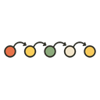
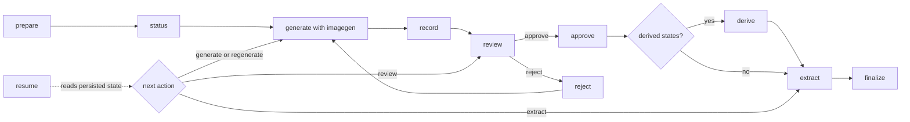
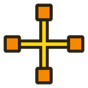

<div align="center"><a name="readme-top"></a>

[![icon-forge - icon & sticker pack pipeline][image-banner]][repo-link]

# icon-forge

**AI-powered icon and sticker pack pipeline for [Codex][codex-link].**<br/>
Install it under `~/.codex/skills/` for automatic skill discovery.<br/>
Slack sticker packs, app icon sets, favicons, and other icon-family<br/>
products built end-to-end from a single concept.

[![][github-license-shield]][github-license-link]
[![][python-shield]][python-link]
[![][codex-shield]][codex-link]
[![][pr-welcome-shield]][pr-welcome-link]<br/>
[![][github-stars-shield]][github-stars-link]
[![][github-forks-shield]][github-forks-link]
[![][github-contributors-shield]][github-contributors-link]
[![][github-issues-shield]][github-issues-link]
[![][github-last-commit-shield]][github-last-commit-link]

</div>

<sub align="center"><em>The banner is an illustrative montage of the visual range <code>icon-forge</code> targets. Reproducible, versioned outputs from real runs are shown in <a href="#examples">Examples</a>.</em></sub>

## <picture><source media="(prefers-color-scheme: dark)" srcset="assets/sections/what-it-makes-dark.png"></picture> What it makes

Each "bundle" is a complete icon product. Same engine, four output shapes.

<table>
<tr>
  <th align="center" width="50%">
    <a href="profiles/bundles/slack-stickers.json"></a>
    <br/><br/><code>slack-stickers</code>
  </th>
  <th align="center" width="50%">
    <a href="profiles/bundles/app-icons.json"></a>
    <br/><br/><code>app-icons</code>
  </th>
</tr>
<tr>
  <td valign="top" align="center">
    1-12 motifs × <strong>4 transparent PNG sizes</strong><br/>
    (128, 256, 512, 1024)<br/>
    + Slack import README
    <br/><br/>
    <sub><strong>Custom Slack emoji packs</strong><br/>You supply themes via <code>--variant</code>.</sub>
  </td>
  <td valign="top" align="center">
    One design rendered at<br/><strong>8 platform sizes</strong> (16 → 1024)<br/>
    + usage README
    <br/><br/>
    <sub><strong>App icons, favicons</strong><br/>One concept, every required size.</sub>
  </td>
</tr>
<tr>
  <th align="center" width="50%">
    <a href="profiles/bundles/app-icon-set.json">
      
      
    </a>
    <br/><br/><code>app-icon-set</code>
  </th>
  <th align="center" width="50%">
    <a href="profiles/bundles/web-brand-kit.json">
      
      
    </a>
    <br/><br/><code>web-brand-kit</code>
  </th>
</tr>
<tr>
  <td valign="top" align="center">
    1-12 distinct designs<br/>× <strong>8 sizes each</strong><br/>
    + family README
    <br/><br/>
    <sub><strong>Multi-target icon families</strong><br/>Main + share-ext + watch + ...</sub>
  </td>
  <td valign="top" align="center">
    One coherent brand mark<br/>→ <strong>9 browser/PWA artifacts</strong><br/>
    PNGs + ICO + manifest + README
    <br/><br/>
    <sub><strong>Favicons and PWA assets</strong><br/>One mark, every browser target.</sub>
  </td>
</tr>
</table>

The app and web cards use real marks from the versioned [`monoline-suite`](examples/app-icon-set/monoline-suite/) example to show each packaging shape; bundle-specific file layouts are defined by their linked profiles.

You author new bundles as JSON profiles plus prompt templates. No engine code change for typical new products.

<div align="right">

[![][back-to-top-shield]](#readme-top)

</div>

## <picture><source media="(prefers-color-scheme: dark)" srcset="assets/sections/requirements-dark.png"></picture> Requirements

- Codex CLI / desktop app (with skill discovery)
- Python 3.10+
- Pillow, installed into the skill-local virtual environment below
- The `$imagegen` system skill (preinstalled with Codex) for image generation

## <picture><source media="(prefers-color-scheme: dark)" srcset="assets/sections/install-dark.png"></picture> Install

```bash
SKILL_DIR="${CODEX_HOME:-$HOME/.codex}/skills/icon-forge"
mkdir -p "$(dirname "$SKILL_DIR")"
git clone https://github.com/RWitzner/codex-icon-forge.git "$SKILL_DIR"
python3 -m venv "$SKILL_DIR/.venv"
"$SKILL_DIR/.venv/bin/python" -m pip install --upgrade pip
"$SKILL_DIR/.venv/bin/python" -m pip install -r "$SKILL_DIR/requirements.txt"
```

Codex loads skills from `$CODEX_HOME/skills` (default `~/.codex/skills`). If the skill does not appear immediately, restart Codex.

<details>
<summary>Sharing one checkout across several agents</summary>

If you keep agent skills in `$HOME/.agents/skills` so that other tools can find them too, install there and symlink the checkout into the directory Codex actually scans:

```bash
SKILL_DIR="$HOME/.agents/skills/icon-forge"
mkdir -p "$HOME/.agents/skills" "${CODEX_HOME:-$HOME/.codex}/skills"
git clone https://github.com/RWitzner/codex-icon-forge.git "$SKILL_DIR"
ln -s "$SKILL_DIR" "${CODEX_HOME:-$HOME/.codex}/skills/icon-forge"
python3 -m venv "$SKILL_DIR/.venv"
"$SKILL_DIR/.venv/bin/python" -m pip install --upgrade pip
"$SKILL_DIR/.venv/bin/python" -m pip install -r "$SKILL_DIR/requirements.txt"
```

`$HOME/.agents/skills` on its own is not scanned by Codex; without the symlink the skill will not load.

</details>

Then ask for a sticker pack, app icon set, or web brand kit:

- **ChatGPT desktop** - type `@` and select `icon-forge`.
- **Codex CLI / IDE** - run `/skills` or type `$icon-forge` to select it explicitly.
- **Implicit invocation** - describe the icon or sticker product naturally; Codex can select the skill from its description.

Either way the underlying engine is identical.

<div align="right">

[![][back-to-top-shield]](#readme-top)

</div>

## <picture><source media="(prefers-color-scheme: dark)" srcset="assets/sections/examples-dark.png"></picture> Examples

Three curated previews from real runs, spanning two bundles and two completely different visual languages. Current runs use the same gated `prepare → status → generate → record → review → approve → extract → finalize` flow; `reject` and `resume` provide persisted recovery paths.

### `slack-stickers` - flat-vector cartoon

<table>
<tr>
  <th align="center" width="50%"><a href="examples/slack-stickers/dev-pack/"><code>dev-pack</code></a> - 12 stickers</th>
  <th align="center" width="50%"><a href="examples/slack-stickers/coffee-shop-reactions/"><code>coffee-shop-reactions</code></a> - 8 stickers</th>
</tr>
<tr>
  <td valign="top" align="center">
    
    
    <br/>
    
    
    <br/>
    
    
    <br/>
    
    
    
    <br/><br/>
    <sub>Dev workflow themes - shipping, testing, deploying, debugging</sub>
  </td>
  <td valign="top" align="center">
    
    <br/>
    
    <br/>
    
    <br/>
    
    
    <br/><br/>
    <sub>Coffee shop reactions - sipping, spilling, brewing, beaning</sub>
  </td>
</tr>
</table>

### `app-icon-set` - monoline brand marks

A completely different visual language - single-weight stroke, no fills, charcoal on warm off-white squircle, single teal accent applied to one specific detail per icon. Same pipeline, different `style` profile.

<a href="examples/app-icon-set/monoline-suite/"><code>monoline-suite</code></a> - 8 distinct app icons × 8 platform sizes (16, 32, 64, 128, 180, 256, 512, 1024) = **64 PNG files**.

<table align="center">
<tr>
  <td align="center"><br/><sub><code>calendar</code></sub></td>
  <td align="center"><br/><sub><code>mail</code></sub></td>
  <td align="center"><br/><sub><code>notes</code></sub></td>
  <td align="center"><br/><sub><code>maps</code></sub></td>
  <td align="center"><br/><sub><code>music</code></sub></td>
  <td align="center"><br/><sub><code>camera</code></sub></td>
  <td align="center"><br/><sub><code>wallet</code></sub></td>
  <td align="center"><br/><sub><code>search</code></sub></td>
</tr>
</table>

<p align="center"><sub>Same family, different motif - accent applied per-icon to one specific element (the circled date, envelope seal, pencil tip, destination star, note head, shutter dot, chip, lens mark).</sub></p>

<p align="center"><strong>One variant across all 8 platform sizes:</strong></p>

<p align="center">
  &nbsp;
  &nbsp;
  &nbsp;
  &nbsp;
  &nbsp;
  
</p>

<p align="center"><sub>16 · 32 · 64 · 128 · 180 · 256 px (rendered at native pixel dimensions). Sizes 512 and 1024 omitted from this strip; full set lives in the folder.</sub></p>

<div align="right">

[![][back-to-top-shield]](#readme-top)

</div>

## <picture><source media="(prefers-color-scheme: dark)" srcset="assets/sections/workflow-dark.png"></picture> Workflow

A resumable gated workflow owned by the parent agent. Subagents only call `$imagegen` and return paths; every write into the run folder happens in the parent.



<details>
<summary><kbd><strong>Full command sequence</strong></kbd></summary>

```bash
SKILL_DIR="${CODEX_HOME:-$HOME/.codex}/skills/icon-forge"
PYTHON="$SKILL_DIR/.venv/bin/python"

# 1. Prepare a run folder, prompts, and a job manifest. Pass one --variant
#    id:purpose per sticker (1-12 total). Omit --output-dir and the script
#    picks $PWD/output/icon-forge/<entity-id>-<UTC-timestamp>; the chosen
#    path is in the JSON output as run_dir.
RUN=$("$PYTHON" "$SKILL_DIR/scripts/icon_forge.py" prepare \
  --bundle slack-stickers \
  --entity-id dev-pack \
  --display-name "Dev Pack" \
  --description "Dev-themed Slack stickers" \
  --notes "developer workflow icons in flat vector style" \
  --variant "shipping-it:joyful 'we shipped it' celebration" \
  --variant "tests-passing:all-green test suite, calm confident vibe" \
  --variant "merge-conflict:tangled conflict knot, flustered but recoverable" \
  --variant "ci-failed:red broken pipeline, frustrated face" \
  --variant "deploy:rocket lifting off, confident motion" \
  --variant "hotfix:bandage on a server, urgent but stable" \
  --variant "retry:circular arrow, second-attempt energy" \
  --variant "lgtm:thumbs-up, looks good to me" \
  --variant "wip:work-in-progress sign, hard hat" \
  --variant "debug:magnifying glass on bug, focused" \
  --variant "refactor:tidied gears or clean broom, satisfied" \
  --variant "ship:cargo ship sailing, steady and committed" \
  | "$PYTHON" -c 'import json,sys; print(json.load(sys.stdin)["run_dir"])')

# 2. Inspect ready jobs and the prompts to use.
"$PYTHON" "$SKILL_DIR/scripts/icon_forge.py" status --run-dir "$RUN"

# 3. Generate the first ready job with $imagegen. Multi-job runs expose one
#    representative gate job first; the remaining jobs stay blocked.

# 4. Record each generated image. Concurrency-safe; parent runs this serially
#    or in parallel - a sibling lock file keeps manifest writes atomic.
#    The source MUST be a real $imagegen output: $CODEX_HOME/generated_images/.../ig_*.png.
#    Locally drawn or post-processed images are rejected. A rejected job can be
#    recorded again directly; use --force only for a deliberate re-record that
#    did not pass through `reject`. Force never bypasses gates or dependencies.
"$PYTHON" "$SKILL_DIR/scripts/icon_forge.py" record \
  --run-dir "$RUN" --job-id shipping-it \
  --source "$CODEX_HOME/generated_images/.../ig_abc123.png"

# 5. Render QA artifacts, then approve the representative result. `review`
#    writes qa/review-sheet.png and qa/review.json and exits non-zero if a
#    decoded output is missing, corrupt, blank after chroma cleanup, wrong
#    format, wrong strip aspect ratio, too small for the logical strip, unsafe
#    path, or over the 4096x4096 decoded pixel budget. Future not-yet-recorded
#    jobs are shown as skipped placeholders and do not fail the review.
"$PYTHON" "$SKILL_DIR/scripts/icon_forge.py" review --run-dir "$RUN"
"$PYTHON" "$SKILL_DIR/scripts/icon_forge.py" approve \
  --run-dir "$RUN" --job-id shipping-it \
  --note "Style and intent approved"

# If QA fails instead, persist the rejection and regenerate that job:
# "$PYTHON" "$SKILL_DIR/scripts/icon_forge.py" reject \
#   --run-dir "$RUN" --job-id shipping-it \
#   --note "Specific correction needed"

# ...generate + record every newly ready job, then force-refresh the QA sheet
#    before final approval...
"$PYTHON" "$SKILL_DIR/scripts/icon_forge.py" review --run-dir "$RUN" --force
"$PYTHON" "$SKILL_DIR/scripts/icon_forge.py" approve \
  --run-dir "$RUN" --all \
  --note "Final recorded set approved"

# At any point, ask the persisted state machine what to do next.
"$PYTHON" "$SKILL_DIR/scripts/icon_forge.py" resume --run-dir "$RUN"

# 6. Extract approved frames from decoded strips (chroma-key strip + cell crop).
"$PYTHON" "$SKILL_DIR/scripts/icon_forge.py" extract --run-dir "$RUN" --states all

# 7. Compose atlas, validate, and package to the bundle's output layout.
"$PYTHON" "$SKILL_DIR/scripts/icon_forge.py" finalize \
  --bundle slack-stickers \
  --frames "$RUN/frames" \
  --entity-id dev-pack \
  --display-name "Dev Pack" \
  --description "Dev-themed Slack stickers" \
  --output-run-dir "$RUN"
```

Final output for `slack-stickers`: `${ICON_FORGE_HOME:-$HOME/icon-forge}/stickers/dev-pack/` with `128`, `256`, `512`, and `1024` px PNGs at `<sticker>/<sticker>-<size>.png`, plus a `README.md`.

For `app-icons`: `${ICON_FORGE_HOME:-$HOME/icon-forge}/app-icons/<slug>/` with the same design at 8 platform sizes plus a usage README.

For `app-icon-set`: `${ICON_FORGE_HOME:-$HOME/icon-forge}/app-icon-sets/<slug>/<variant>/<variant>-<size>.png` for every (variant, size) pair plus a family README at the slug root.

For `web-brand-kit`: `${ICON_FORGE_HOME:-$HOME/icon-forge}/web-brand-kits/<slug>/` with six PNG sizes, `favicon.ico`, `site.webmanifest`, and a usage README.

</details>

<details>
<summary><kbd><strong>Recommended preset - <code>dev-pack</code></strong></kbd></summary>

The `slack-stickers` bundle is dynamic - you decide what each sticker is. The versioned `dev-pack` preview below is the canonical preset and is reproduced by passing these 12 variants:

```bash
--variant "shipping-it:joyful 'we shipped it' celebration"
--variant "tests-passing:all-green test suite, calm confident vibe"
--variant "merge-conflict:tangled conflict knot, flustered but recoverable"
--variant "ci-failed:red broken pipeline, frustrated face"
--variant "deploy:rocket lifting off, confident motion"
--variant "hotfix:bandage on a server, urgent but stable"
--variant "retry:circular arrow, second-attempt energy"
--variant "lgtm:thumbs-up, looks good to me"
--variant "wip:work-in-progress sign, hard hat"
--variant "debug:magnifying glass on bug, focused"
--variant "refactor:tidied gears or clean broom, satisfied"
--variant "ship:cargo ship sailing, steady and committed"
```

> [!TIP]
> Want stickers for something else? Replace these 12 with your own `id:purpose` pairs. Rules: 1-12 variants per run, IDs match `^[a-z0-9][a-z0-9-]{0,30}$`, purposes are concrete visual concepts (not mood labels - `coffee-time:steaming mug with rising swirl` not `coffee-time:cozy vibes`) at most 200 chars.

</details>

<details>
<summary><kbd><strong>Icon families with <code>app-icon-set</code></strong></kbd></summary>

Pass one `--variant id:purpose` per design (1-12 per run). IDs must match `^[a-z0-9][a-z0-9-]{0,30}$` and be unique; purpose is required and at most 200 chars. Use `id@role:purpose` only when the style profile defines a semantic prompt role for that variant; `id:purpose` remains the default role. The bundled launcher style supports `watch@watch:...` and `notification@notification:...` for silhouette variants, while exact IDs `watch` and `notification` still keep the legacy automatic behavior.

```bash
"$PYTHON" "$SKILL_DIR/scripts/icon_forge.py" prepare \
  --bundle app-icon-set \
  --entity-id myapp \
  --display-name "MyApp" \
  --description "MyApp icon family" \
  --notes "modern minimalist, bold silhouette" \
  --variant "main:primary app icon" \
  --variant "share-ext:share extension, simpler version" \
  --variant "watch@watch:1-bit silhouette for watchOS"
```

Each variant becomes its own `$imagegen` job. The first variant is a persisted approval gate; after it is recorded and approved, fan the remaining ready jobs out to subagents. The rest of the workflow (`status`, `record`, `approve`, `extract`, `finalize`) is identical; the bundle reloads its variants and prompt roles from `request.json` automatically.

</details>

<div align="right">

[![][back-to-top-shield]](#readme-top)

</div>

## <picture><source media="(prefers-color-scheme: dark)" srcset="assets/sections/architecture-dark.png"></picture> Architecture

Four orthogonal axes. A **bundle** names one of each.

| Axis | Controls | Profile path |
|---|---|---|
| **Atlas** | Cell geometry, state catalog, derivation rules | `profiles/atlas/<id>.json` |
| **Style** | Target kind, prompt templates, forbidden artifacts, semantic prompt roles, chroma key candidates | `profiles/style/<id>/profile.json` |
| **Extractor** | Background removal + frame extraction strategy | `profiles/extractor/<id>.json` |
| **Packager** | Output layout strategy (`atlas-extract-folder`, `multi-size-folder`, `web-brand-kit`, ...) | `profiles/packager/<id>.json` |

### Adding your own bundle

1. Decide the output shape: how many designs, how many sizes per design, how files should be named on disk.
2. Pick a packager strategy (`atlas-extract-folder` for sticker-style packs, `multi-size-folder` for multi-size icon packs, `web-brand-kit` for canonical browser/PWA assets, or write a new one).
3. Author the five profile JSONs and two prompt templates.
4. Add to `profiles/bundles/<your-bundle>.json` and run `"$PYTHON" "$SKILL_DIR/scripts/icon_forge.py" show <your-bundle>` to verify.

See [`references/profile-schema.md`](references/profile-schema.md) for the canonical schema documentation.

### Private extension profile roots

Keep private or local-only bundles outside this repository by creating a profile root with the same layout as `profiles/`:

```text
my-private-profiles/
├── bundles/<bundle-id>.json
├── atlas/<atlas-id>.json
├── style/<style-id>/profile.json
├── style/<style-id>/templates/base.txt
├── style/<style-id>/templates/row.txt
├── extractor/<extractor-id>.json
└── packager/<packager-id>.json
```

Profile roots are searched in this order: repeatable CLI `--profile-dir` entries, then `ICON_FORGE_PROFILE_PATH` entries split by the platform path separator, then the bundled `profiles/` directory. First match wins, and bundle components resolve independently across the full root chain, so a private bundle may reuse bundled atlas/style/extractor/packager profiles.

```bash
"$PYTHON" "$SKILL_DIR/scripts/icon_forge.py" bundles \
  --profile-dir "$HOME/icon-forge-profiles"
ICON_FORGE_PROFILE_PATH="$HOME/icon-forge-profiles:$HOME/team-profiles" \
  "$PYTHON" "$SKILL_DIR/scripts/icon_forge.py" show my-private-bundle
"$PYTHON" "$SKILL_DIR/scripts/icon_forge.py" prepare \
  --profile-dir "$HOME/icon-forge-profiles" \
  --bundle my-private-bundle --entity-id sample --description "Private profile smoke test"
```

`prepare` persists absolute external profile roots in `request.json` as `profile_roots` and excludes the bundled root. Later `review`, `extract`, `derive`, and `finalize` rehydrate from those persisted roots by default, so changing `ICON_FORGE_PROFILE_PATH` after preparation cannot silently change a run. Pass `--profile-dir` to a run command only when you intentionally want to override the persisted roots. Profile JSON and templates are not copied into the run folder; only root paths are recorded.

<div align="right">

[![][back-to-top-shield]](#readme-top)

</div>

## <picture><source media="(prefers-color-scheme: dark)" srcset="assets/sections/safety-dark.png"></picture> Safety guarantees

The parent agent owns all writes into the run directory. Subagents only generate images and return paths; the parent calls `record`, `review`, `approve`, `reject`, `extract`, `derive`, and `finalize`. Five programmatic guards back this contract, plus one advisory step:

- **Prompt profile metadata.** Prepared runs persist each state's style ID, prompt profile version, and semantic role in `request.json` and in every `imagegen-jobs.json` job. Older manifests without this field still load.
- **Concurrency.** `record` and `derive` serialise their manifest read-modify-write under a sibling lock file (`imagegen-jobs.json.lock`). Parallel record calls from a fan-out cannot drop status updates. Manifest writes use a unique tmp filename + `os.replace` so concurrent writers do not collide on the tmp path either.
- **Persisted approval gate.** A multi-job run exposes only its first representative job until that result is approved. Jobs whose dependencies are not approved cannot be recorded, and `extract` refuses every selected output whose review state is not `approved`. Rejecting a gate or dependency - or replacing its image with `record --force` - invalidates already-recorded affected outputs so stale fan-out cannot later be extracted. `resume` reports whether the next action is `generate`, `review`, `regenerate`, or `extract`.
- **Output validation.** `finalize` refuses to package an atlas whose cells kept their chroma background, are empty or too sparse, sit in a column no state declares, or carry the wrong dimensions, format, or alpha channel. The near-opaque test is measured against the area a cell can actually hold after extraction padding, so it is reachable for every bundled geometry.

- **Provenance.** `record` rejects any source path that is not `$CODEX_HOME/generated_images/.../ig_*.png`, and any path inside the run directory itself. Locally drawn or post-processed images cannot be ingested as visual job outputs. The hidden `--allow-synthetic-test-source` flag bypasses the check for unit tests only - never use it in real runs.
- **Overwrite guard.** `record` refuses to replace a job's existing decoded output unless `--force` is passed or the persisted review state is `rejected`. A stale subagent result, a double-record bug, or a parallel race cannot silently overwrite an approved image.

And one advisory step, which is deliberately *not* a gate:

- **Visual QA.** `review` writes `qa/review-sheet.png` and `qa/review.json` from decoded outputs without altering source images. Future pending jobs are shown as skipped placeholders; at least one completed visual output must be present. The sheet shows each completed visual job on light and dark checkerboards after the same chroma cleanup used by extraction. The JSON records raw source dimensions/mode/format, cleaned alpha bounds, validation errors, and the logical expected strip size. High-resolution decoded masters are valid when their aspect ratio matches the logical strip (`cell_width * frames` by `cell_height`) and they are not smaller than that logical size. Manifest `output_path` values must be relative paths under `decoded/` with no parent components or symlink escapes. Decoded images above 16,777,216 pixels are rejected before RGBA conversion or chroma cleanup.

  Nothing reads `qa/review.json` back: `approve` selects on recorded status alone, so a run can go `record → approve --all → extract → finalize` without `review` ever being called. Treat it as the artifact a human looks at, not as an enforced check.

> [!IMPORTANT]
> The provenance check is the difference between a trustworthy run folder and a polluted one. Never use `--allow-synthetic-test-source` outside of unit tests - it exists solely so the test suite can fabricate inputs without touching `$imagegen`.

<div align="right">

[![][back-to-top-shield]](#readme-top)

</div>

## <picture><source media="(prefers-color-scheme: dark)" srcset="assets/sections/chroma-cleanup-dark.png"></picture> Chroma edge cleanup

Chroma extraction is a two-step process. The colour-distance threshold zeros alpha (and RGB) on solid chroma-coloured pixels, but image models almost always produce anti-aliased fringe pixels along the silhouette boundary that the threshold alone cannot catch - at 1024×1024 these show up as a visible magenta or cyan halo. An alpha-only erode + Gaussian blur pass cleans them up:

1. **Erode** shrinks the alpha mask by `alpha_erode_px` pixels, removing the fringe band entirely.
2. **Blur** softens the new mask edge with a Gaussian of `alpha_blur_radius` for clean anti-aliasing.

RGB inside the silhouette is never touched. RGB on chroma-killed and erode-cleared pixels is zeroed so that blur does not revive a tinted halo. Tune both knobs in `profiles/extractor/chroma-key-slots.json` per bundle. Defaults of `alpha_erode_px: 1, alpha_blur_radius: 1.0` work well for both 128×128 stickers and 1024×1024 icons.

<div align="right">

[![][back-to-top-shield]](#readme-top)

</div>

## <picture><source media="(prefers-color-scheme: dark)" srcset="assets/sections/tests-dark.png"></picture> Tests

```bash
cd "${CODEX_HOME:-$HOME/.codex}/skills/icon-forge"
.venv/bin/python -m pip install -r requirements.txt
.venv/bin/python -m unittest discover -s tests -p 'test_*.py' -t . -v
```

Covers: profile loader, role-based prompt composition, composer, validator (every failure branch, and that `finalize` refuses to package an atlas which kept its background), two extractor strategies, multi-size, sticker-folder, and web-brand-kit packagers including the flattened store-compliant output, end-to-end orchestration for all shipped bundles (`slack-stickers`, `app-icons`, `app-icon-set`, `web-brand-kit`), parallel-record concurrency safety, source-provenance enforcement, overwrite guard and forced-re-record invalidation, entity-id and dynamic-state variant validation, external private profile-root discovery, chroma edge cleanup, and the public-documentation and no-private-content contracts.

<div align="right">

[![][back-to-top-shield]](#readme-top)

</div>

## <picture><source media="(prefers-color-scheme: dark)" srcset="assets/sections/history-dark.png"></picture> Architecture history

icon-forge was extracted from earlier Codex skill experiments and narrowed to static icon and sticker-pack products. See [`NOTICE`](NOTICE) for attribution context.

## <picture><source media="(prefers-color-scheme: dark)" srcset="assets/sections/contributing-dark.png"></picture> Contributing

Contributions are welcome. Start with [`CONTRIBUTING.md`](CONTRIBUTING.md), run the full unittest suite before opening a pull request, and keep generated run folders or local imagegen outputs out of git.

<details>
<summary><kbd>Star history</kbd></summary>

<picture>
  <source media="(prefers-color-scheme: dark)" srcset="https://api.star-history.com/svg?repos=RWitzner/codex-icon-forge&theme=dark&type=Date">
  
</picture>

</details>

## <picture><source media="(prefers-color-scheme: dark)" srcset="assets/sections/license-dark.png"></picture> License

Apache-2.0 - see [`LICENSE`](LICENSE).

The example assets under `examples/` are distributed with the repository under the same license unless a file says otherwise. Generated outputs created by users of the skill are their responsibility; avoid prompts or reference images that infringe third-party trademarks, copyright, or publicity rights.

<div align="right">

[![][back-to-top-shield]](#readme-top)

</div>

<!-- LINK GROUP -->

[repo-link]: https://github.com/RWitzner/codex-icon-forge
[codex-link]: https://github.com/openai/codex
[image-banner]: assets/hero.png

[back-to-top-shield]: https://img.shields.io/badge/-BACK_TO_TOP-2a2520?style=flat-square

[github-license-link]: https://github.com/RWitzner/codex-icon-forge/blob/main/LICENSE
[github-license-shield]: https://img.shields.io/github/license/RWitzner/codex-icon-forge?style=flat-square&labelColor=2a2520&color=9c8a73

[python-link]: https://www.python.org
[python-shield]: https://img.shields.io/badge/python-3.10%2B-7db7d9?style=flat-square&labelColor=2a2520&logo=python&logoColor=f5efe3

[codex-shield]: https://img.shields.io/badge/codex-skill-c97b5c?style=flat-square&labelColor=2a2520

[pr-welcome-link]: https://github.com/RWitzner/codex-icon-forge/pulls
[pr-welcome-shield]: https://img.shields.io/badge/PRs-welcome-7ba77b?style=flat-square&labelColor=2a2520

[github-stars-link]: https://github.com/RWitzner/codex-icon-forge/stargazers
[github-stars-shield]: https://img.shields.io/github/stars/RWitzner/codex-icon-forge?style=flat-square&labelColor=2a2520&color=e8c367&logo=github&logoColor=f5efe3

[github-forks-link]: https://github.com/RWitzner/codex-icon-forge/network/members
[github-forks-shield]: https://img.shields.io/github/forks/RWitzner/codex-icon-forge?style=flat-square&labelColor=2a2520&color=7db7d9&logo=github&logoColor=f5efe3

[github-contributors-link]: https://github.com/RWitzner/codex-icon-forge/graphs/contributors
[github-contributors-shield]: https://img.shields.io/github/contributors/RWitzner/codex-icon-forge?style=flat-square&labelColor=2a2520&color=7ba77b

[github-issues-link]: https://github.com/RWitzner/codex-icon-forge/issues
[github-issues-shield]: https://img.shields.io/github/issues/RWitzner/codex-icon-forge?style=flat-square&labelColor=2a2520&color=c97b5c

[github-last-commit-link]: https://github.com/RWitzner/codex-icon-forge/commits/main
[github-last-commit-shield]: https://img.shields.io/github/last-commit/RWitzner/codex-icon-forge?style=flat-square&labelColor=2a2520&color=9c8a73
