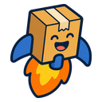
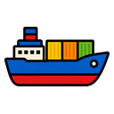
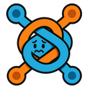
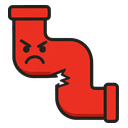
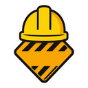

<div align="center"><a name="readme-top"></a>

[![icon-forge — icon & sticker pack pipeline][image-banner]][repo-link]

# icon-forge

**AI-powered icon and sticker pack pipeline for [Codex][codex-link].**<br/>
Drop the folder into `~/.codex/skills/`, restart Codex, and invoke `/icon-forge`<br/>
to build Slack sticker packs, app icon sets, favicons,<br/>
and other icon-family products end-to-end from a single concept.

[![][github-license-shield]][github-license-link]
[![][python-shield]][python-link]
[![][codex-shield]][codex-link]
[![][pr-welcome-shield]][pr-welcome-link]<br/>
[![][github-stars-shield]][github-stars-link]
[![][github-forks-shield]][github-forks-link]
[![][github-contributors-shield]][github-contributors-link]
[![][github-issues-shield]][github-issues-link]
[![][github-last-commit-shield]][github-last-commit-link]

</div>

<sub align="center"><em>The banner above is real output. Every sticker was generated by <code>icon-forge</code> through the canonical <a href="examples/slack-stickers/dev-pack/"><code>dev-pack</code></a> preset — same engine, same chroma-key extractor, same packager you'll run.</em></sub>

##  What it makes

Each "bundle" is a complete icon product. Same engine, three output shapes.

<table>
<tr>
  <th align="center" width="33%">
    <a href="profiles/bundles/slack-stickers.json"></a>
    <br/><br/><code>slack-stickers</code>
  </th>
  <th align="center" width="33%">
    <a href="profiles/bundles/app-icons.json"></a>
    <br/><br/><code>app-icons</code>
  </th>
  <th align="center" width="33%">
    <a href="profiles/bundles/app-icon-set.json"></a>
    <br/><br/><code>app-icon-set</code>
  </th>
</tr>
<tr>
  <td valign="top" align="center">
    1–12 transparent emoji-sized PNGs<br/>
    + Slack import README
    <br/><br/>
    <sub><strong>Custom Slack emoji packs</strong><br/>You supply themes via <code>--variant</code>.</sub>
  </td>
  <td valign="top" align="center">
    One design rendered at<br/><strong>8 platform sizes</strong> (16 → 1024)<br/>
    + usage README
    <br/><br/>
    <sub><strong>App icons, favicons</strong><br/>One concept, every required size.</sub>
  </td>
  <td valign="top" align="center">
    1–12 distinct designs<br/>× <strong>8 sizes each</strong><br/>
    + family README
    <br/><br/>
    <sub><strong>Multi-target icon families</strong><br/>Main + share-ext + watch + ...</sub>
  </td>
</tr>
</table>

You author new bundles as JSON profiles plus prompt templates. No engine code change for typical new products.

<div align="right">

[![][back-to-top-shield]](#readme-top)

</div>

## Requirements

- Codex CLI / desktop app (with skill discovery)
- Python 3.10+
- Pillow (`python -m pip install -r requirements.txt`)
- The `$imagegen` system skill (preinstalled with Codex) for image generation

## Install

```bash
git clone https://github.com/RWitzner/codex-icon-forge.git "${CODEX_HOME:-$HOME/.codex}/skills/icon-forge"
cd "${CODEX_HOME:-$HOME/.codex}/skills/icon-forge"
python -m pip install -r requirements.txt
```

Restart Codex. Invoke `/icon-forge` and ask for a sticker pack or app icon set.

<div align="right">

[![][back-to-top-shield]](#readme-top)

</div>

##  Examples

Two real runs of the `slack-stickers` bundle, each generated end-to-end through `$imagegen`. Same engine, different concept.

<table>
<tr>
  <th align="center" width="50%"><a href="examples/slack-stickers/dev-pack/"><code>dev-pack</code></a> &mdash; 12 stickers</th>
  <th align="center" width="50%"><a href="examples/slack-stickers/coffee-shop-reactions/"><code>coffee-shop-reactions</code></a> &mdash; 8 stickers</th>
</tr>
<tr>
  <td valign="top" align="center">
    
    
    <br/>
    
    
    <br/>
    
    
    <br/>
    
    
    
    <br/><br/>
    <sub>Dev workflow themes &mdash; shipping, testing, deploying, debugging</sub>
  </td>
  <td valign="top" align="center">
    
    <br/>
    
    <br/>
    
    <br/>
    
    
    <br/><br/>
    <sub>Coffee shop reactions &mdash; sipping, spilling, brewing, beaning</sub>
  </td>
</tr>
</table>

<div align="right">

[![][back-to-top-shield]](#readme-top)

</div>

##  Workflow

Five stages, each owned by the parent agent. Subagents only call `$imagegen` and return paths — every write into the run folder happens here.

<div align="center">

[![pipeline — prepare → status → record → extract → finalize][image-pipeline]][repo-link]

</div>

<details>
<summary><kbd><strong>Full command sequence</strong></kbd></summary>

```bash
SKILL_DIR="${CODEX_HOME:-$HOME/.codex}/skills/icon-forge"

# 1. Prepare a run folder, prompts, and a job manifest. Pass one --variant
#    id:purpose per sticker (1-12 total). Omit --output-dir and the script
#    picks $PWD/output/icon-forge/<entity-id>-<UTC-timestamp>; the chosen
#    path is in the JSON output as run_dir.
RUN=$(python "$SKILL_DIR/scripts/icon_forge.py" prepare \
  --bundle slack-stickers \
  --entity-id dev-pack \
  --display-name "Dev Pack" \
  --description "Dev-themed Slack stickers" \
  --notes "developer workflow icons in flat vector style" \
  --variant "shipping-it:joyful 'we shipped it' celebration" \
  --variant "tests-passing:all-green test suite, calm confident vibe" \
  --variant "merge-conflict:tangled conflict knot, flustered but recoverable" \
  --variant "ci-failed:red broken pipeline, frustrated face" \
  --variant "deploy:rocket lifting off, confident motion" \
  --variant "hotfix:bandage on a server, urgent but stable" \
  --variant "retry:circular arrow, second-attempt energy" \
  --variant "lgtm:thumbs-up, looks good to me" \
  --variant "wip:work-in-progress sign, hard hat" \
  --variant "debug:magnifying glass on bug, focused" \
  --variant "refactor:tidied gears or clean broom, satisfied" \
  --variant "ship:cargo ship sailing, steady and committed" \
  | python -c 'import json,sys; print(json.load(sys.stdin)["run_dir"])')

# 2. Inspect ready jobs and the prompts to use.
python "$SKILL_DIR/scripts/icon_forge.py" status --run-dir "$RUN"

# 3. (Codex fans out subagents to call $imagegen for each ready job.)

# 4. Record each generated image. Concurrency-safe; parent runs this serially
#    or in parallel — a sibling lock file keeps manifest writes atomic.
#    The source MUST be a real $imagegen output: $CODEX_HOME/generated_images/.../ig_*.png.
#    Locally drawn or post-processed images are rejected. Use --force to replace
#    an already-recorded job (e.g. after a regenerate).
python "$SKILL_DIR/scripts/icon_forge.py" record \
  --run-dir "$RUN" --job-id shipping-it \
  --source "$CODEX_HOME/generated_images/.../ig_abc123.png"

# 5. Extract frames from decoded strips (chroma-key strip + cell crop).
python "$SKILL_DIR/scripts/icon_forge.py" extract --run-dir "$RUN" --states all

# 6. Compose atlas, validate, and package to the bundle's output layout.
python "$SKILL_DIR/scripts/icon_forge.py" finalize \
  --bundle slack-stickers \
  --frames "$RUN/frames" \
  --entity-id dev-pack \
  --display-name "Dev Pack" \
  --description "Dev-themed Slack stickers" \
  --output-run-dir "$RUN"
```

Final output for `slack-stickers`: `${ICON_FORGE_HOME:-$HOME/icon-forge}/stickers/dev-pack/` with one PNG per sticker plus a `README.md`.

For `app-icons`: `${ICON_FORGE_HOME:-$HOME/icon-forge}/app-icons/<slug>/` with the same design at 8 platform sizes plus a usage README.

For `app-icon-set`: `${ICON_FORGE_HOME:-$HOME/icon-forge}/app-icon-sets/<slug>/<variant>/<variant>-<size>.png` for every (variant, size) pair plus a family README at the slug root.

</details>

<details>
<summary><kbd><strong>Recommended preset — <code>dev-pack</code></strong></kbd></summary>

The `slack-stickers` bundle is dynamic — you decide what each sticker is. The `dev-pack` shown in the banner is the canonical example and is reproduced verbatim by passing these 12 variants:

```bash
--variant "shipping-it:joyful 'we shipped it' celebration"
--variant "tests-passing:all-green test suite, calm confident vibe"
--variant "merge-conflict:tangled conflict knot, flustered but recoverable"
--variant "ci-failed:red broken pipeline, frustrated face"
--variant "deploy:rocket lifting off, confident motion"
--variant "hotfix:bandage on a server, urgent but stable"
--variant "retry:circular arrow, second-attempt energy"
--variant "lgtm:thumbs-up, looks good to me"
--variant "wip:work-in-progress sign, hard hat"
--variant "debug:magnifying glass on bug, focused"
--variant "refactor:tidied gears or clean broom, satisfied"
--variant "ship:cargo ship sailing, steady and committed"
```

> [!TIP]
> Want stickers for something else? Replace these 12 with your own `id:purpose` pairs. Rules: 1–12 variants per run, IDs match `^[a-z0-9][a-z0-9-]{0,30}$`, purposes are concrete visual concepts (not mood labels — `coffee-time:steaming mug with rising swirl` not `coffee-time:cozy vibes`) at most 200 chars.

</details>

<details>
<summary><kbd><strong>Icon families with <code>app-icon-set</code></strong></kbd></summary>

Pass one `--variant id:purpose` per design (1–12 per run). IDs must match `^[a-z0-9][a-z0-9-]{0,30}$` and be unique; purpose is required and at most 200 chars.

```bash
python "$SKILL_DIR/scripts/icon_forge.py" prepare \
  --bundle app-icon-set \
  --entity-id myapp \
  --display-name "MyApp" \
  --description "MyApp icon family" \
  --notes "modern minimalist, bold silhouette" \
  --output-dir "$RUN" \
  --variant "main:primary app icon" \
  --variant "share-ext:share extension, simpler version" \
  --variant "watch:1-bit silhouette for watchOS"
```

Each variant becomes its own `$imagegen` job — fan them out to subagents in parallel just like sticker generation. The rest of the workflow (`status`, `record`, `extract`, `finalize`) is identical; the bundle reloads its variants from `request.json` automatically.

</details>

<div align="right">

[![][back-to-top-shield]](#readme-top)

</div>

##  Architecture

Four orthogonal axes. A **bundle** names one of each.

| Axis | Controls | Profile path |
|---|---|---|
| **Atlas** | Cell geometry, state catalog, derivation rules | `profiles/atlas/<id>.json` |
| **Style** | Target kind, prompt templates, forbidden artifacts, chroma key candidates | `profiles/style/<id>/profile.json` |
| **Extractor** | Background removal + frame extraction strategy | `profiles/extractor/<id>.json` |
| **Packager** | Output layout strategy (`atlas-extract-folder`, `multi-size-folder`, ...) | `profiles/packager/<id>.json` |

### Adding your own bundle

1. Decide the output shape: how many designs, how many sizes per design, how files should be named on disk.
2. Pick a packager strategy (`atlas-extract-folder` for sticker-style packs, `multi-size-folder` for multi-size icon packs, or write a new one).
3. Author the five profile JSONs and two prompt templates.
4. Add to `profiles/bundles/<your-bundle>.json` and run `python scripts/icon_forge.py show <your-bundle>` to verify.

See [`references/profile-schema.md`](references/profile-schema.md) for the canonical schema documentation.

<div align="right">

[![][back-to-top-shield]](#readme-top)

</div>

##  Safety guarantees

The parent agent owns all writes into the run directory. Subagents only generate images and return paths; the parent calls `record`, `extract`, `derive`, and `finalize`. Three programmatic guards back this contract:

- **Concurrency.** `record` and `derive` serialise their manifest read-modify-write under a sibling lock file (`imagegen-jobs.json.lock`). Parallel record calls from a fan-out cannot drop status updates. Manifest writes use a unique tmp filename + `os.replace` so concurrent writers cannot collide on the tmp path either.
- **Provenance.** `record` rejects any source path that is not `$CODEX_HOME/generated_images/.../ig_*.png`, and any path inside the run directory itself. Locally drawn or post-processed images cannot be ingested as visual job outputs. The hidden `--allow-synthetic-test-source` flag bypasses the check for unit tests only — never use it in real runs.
- **Overwrite guard.** `record` refuses to replace a job's existing decoded output unless `--force` is passed. A stale subagent result, a double-record bug, or a parallel race cannot silently overwrite an already-approved image. Re-recording after an explicit regenerate is one flag away.

> [!IMPORTANT]
> The provenance check is the difference between a trustworthy run folder and a polluted one. Never use `--allow-synthetic-test-source` outside of unit tests — it exists solely so the test suite can fabricate inputs without touching `$imagegen`.

<div align="right">

[![][back-to-top-shield]](#readme-top)

</div>

## Chroma edge cleanup

Chroma extraction is a two-step process. The colour-distance threshold zeros alpha (and RGB) on solid chroma-coloured pixels, but image models almost always produce anti-aliased fringe pixels along the silhouette boundary that the threshold alone cannot catch — at 1024×1024 these show up as a visible magenta or cyan halo. An alpha-only erode + Gaussian blur pass cleans them up:

1. **Erode** shrinks the alpha mask by `alpha_erode_px` pixels, removing the fringe band entirely.
2. **Blur** softens the new mask edge with a Gaussian of `alpha_blur_radius` for clean anti-aliasing.

RGB inside the silhouette is never touched. RGB on chroma-killed and erode-cleared pixels is zeroed so that blur does not revive a tinted halo. Tune both knobs in `profiles/extractor/chroma-key-slots.json` per bundle. Defaults of `alpha_erode_px: 1, alpha_blur_radius: 1.0` work well for both 128×128 stickers and 1024×1024 icons.

<div align="right">

[![][back-to-top-shield]](#readme-top)

</div>

##  Tests

```bash
cd "${CODEX_HOME:-$HOME/.codex}/skills/icon-forge"
python -m pip install -r requirements.txt
python -m unittest discover tests -v
```

Covers: profile loader, prompt composition, composer, validator, two extractor strategies, multi-size and sticker-folder packagers, end-to-end orchestration for all three shipped bundles (`slack-stickers`, `app-icons`, `app-icon-set`), parallel-record concurrency safety, source-provenance enforcement, overwrite guard, dynamic-state variant validation, and chroma edge cleanup.

<div align="right">

[![][back-to-top-shield]](#readme-top)

</div>

## Architecture history

icon-forge was extracted from earlier Codex skill experiments and narrowed to static icon and sticker-pack products. See [`NOTICE`](NOTICE) for attribution context.

## Contributing

Contributions are welcome. Start with [`CONTRIBUTING.md`](CONTRIBUTING.md), run the full unittest suite before opening a pull request, and keep generated run folders or local imagegen outputs out of git.

<details>
<summary><kbd>Star history</kbd></summary>

<picture>
  <source media="(prefers-color-scheme: dark)" srcset="https://api.star-history.com/svg?repos=RWitzner/codex-icon-forge&theme=dark&type=Date">
  
</picture>

</details>

## License

Apache-2.0 — see [`LICENSE`](LICENSE).

The example assets under `examples/` are distributed with the repository under the same license unless a file says otherwise. Generated outputs created by users of the skill are their responsibility; avoid prompts or reference images that infringe third-party trademarks, copyright, or publicity rights.

<div align="right">

[![][back-to-top-shield]](#readme-top)

</div>

<!-- LINK GROUP -->

[repo-link]: https://github.com/RWitzner/codex-icon-forge
[codex-link]: https://github.com/openai/codex
[image-banner]: assets/hero.png
[image-pipeline]: assets/pipeline.png

[back-to-top-shield]: https://img.shields.io/badge/-BACK_TO_TOP-2a2520?style=flat-square

[github-license-link]: https://github.com/RWitzner/codex-icon-forge/blob/main/LICENSE
[github-license-shield]: https://img.shields.io/github/license/RWitzner/codex-icon-forge?style=flat-square&labelColor=2a2520&color=9c8a73

[python-link]: https://www.python.org
[python-shield]: https://img.shields.io/badge/python-3.10%2B-7db7d9?style=flat-square&labelColor=2a2520&logo=python&logoColor=f5efe3

[codex-shield]: https://img.shields.io/badge/codex-skill-c97b5c?style=flat-square&labelColor=2a2520

[pr-welcome-link]: https://github.com/RWitzner/codex-icon-forge/pulls
[pr-welcome-shield]: https://img.shields.io/badge/PRs-welcome-7ba77b?style=flat-square&labelColor=2a2520

[github-stars-link]: https://github.com/RWitzner/codex-icon-forge/stargazers
[github-stars-shield]: https://img.shields.io/github/stars/RWitzner/codex-icon-forge?style=flat-square&labelColor=2a2520&color=e8c367&logo=github&logoColor=f5efe3

[github-forks-link]: https://github.com/RWitzner/codex-icon-forge/network/members
[github-forks-shield]: https://img.shields.io/github/forks/RWitzner/codex-icon-forge?style=flat-square&labelColor=2a2520&color=7db7d9&logo=github&logoColor=f5efe3

[github-contributors-link]: https://github.com/RWitzner/codex-icon-forge/graphs/contributors
[github-contributors-shield]: https://img.shields.io/github/contributors/RWitzner/codex-icon-forge?style=flat-square&labelColor=2a2520&color=7ba77b

[github-issues-link]: https://github.com/RWitzner/codex-icon-forge/issues
[github-issues-shield]: https://img.shields.io/github/issues/RWitzner/codex-icon-forge?style=flat-square&labelColor=2a2520&color=c97b5c

[github-last-commit-link]: https://github.com/RWitzner/codex-icon-forge/commits/main
[github-last-commit-shield]: https://img.shields.io/github/last-commit/RWitzner/codex-icon-forge?style=flat-square&labelColor=2a2520&color=9c8a73
